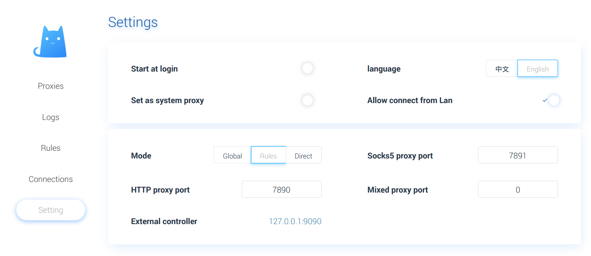

---

## 一、前提条件

在开始之前，我首先默认你已经具备以下基本条件和前提：

- 玩过一点树莓派
- 拥有一个支持Clash的机场

## 二、下载Clash

在这里我们使用Clash作为科学上网的代理框架，你可以到GitHub下载[Clash内核](https://github.com/Dreamacro/clash/releases)。如果你是**树莓派4B 32位操作系统**，那么你应该下载对应armv7版本的[clash-linux-armv7-v1.11.0.gz](https://github.com/Dreamacro/clash/releases/download/v1.11.0/clash-linux-armv7-v1.11.0.gz)，如果是**树莓派4B 64位操作系统**，那么你应该下载对应armv7版本的[clash-linux-armv8-v1.11.0.gz](https://github.com/Dreamacro/clash/releases/download/v1.11.0/clash-linux-armv8-v1.11.0.gz)。

其他型号的树莓派可以通过以下命令查看树莓派的架构：

```bash
arch
```


下载完成后解压文件，建议把文件名改为`clash`， 然后移动到`/usr/local/bin/clash`位置，同时给该文件以执行的权限：

```bash
wget https://github.com/Dreamacro/clash/releases/download/v1.10.6/clash-linux-armv7-v1.10.6.gz
gunzip clash-linux-armv7-v1.10.6.gz
rm -rf clash-linux-armv7-v1.10.6.gz
mv clash-linux-armv7 clash
sudo mv clash /usr/local/bin
sudo chmod a+x /usr/local/bin/clash
```

## 三、配置Clash

Clash配置文件的默认路径是`~/.config/clash`，如果你的Home目录不存在相应文件夹就需要你自己创建，然后把你机场提供的配置文件放到该文件下就可以了，Clash配置文件的默认名称应该是`config.yaml`。

```bash
mkdir ~/.config/clash
mv your/clash/config/file config.yaml
mv config.yaml ~/.config/clash
```

另外Clash还需要一个Country.mmdb文件，Country.mmdb是全球IP库，可以实现各个国家的IP信息解析和地理定位，没有这个文件clash无法正常启动，你可以前往[GitHub下载](https://github.com/SukkaW/Koolshare-Clash/blob/master/koolclash/koolclash/config/Country.mmdb)。下载完成后同样放在默认路径下就可以了`~/.config/clash`。

## 四、配置终端代理

首先我们需要添加几个环境变量：

```bash
sudo vim /etc/environment
```

然后添加以下配置内容：

```
export http_proxy="http://127.0.0.1:7890"
export https_proxy="http://127.0.0.1:7890"
export no_proxy="localhost, 127.0.0.1, *edu.cn"
```

> 注意：系统变量的https_proxy的代理地址和http_proxy的代理地址是一样的，因为Clash使用一个地址同时代理http和https。另外，no_proxy表示其中的地址不需要代理，这一点很重要，比如我们不需要代理我们的校园网地址，因此加入要`*edu.cn`。

然后再对相应的终端应用配置代理：


<!-- tab 为sudo配置代理@fab fa-python -->

进入sudo配置文件：

```bash
sudo visudo
```

然后添加以下内容：

```
Defaults env_keep+="http_proxy https_proxy no_proxy"
```

<!-- endtab -->
<!-- tab 为apt配置代理@fab fa-python -->

进入apt配置文件：

```bash
sudo vim /etc/apt/apt.conf.d/10proxy
```

然后添加以下内容：

```
Acquire::http::Proxy "http://127.0.0.1:7890/";
```

<!-- endtab -->
<!-- tab 为git配置代理@fab fa-python -->

进入git配置文件：

```bash
vim ~/.gitconfig
```

然后添加以下内容：

```bash
[http]
  proxy=http://127.0.0.1:7890
[https]
  proxy=http://127.0.0.1:7890
```

<!-- endtab -->


<!-- tab 为pip配置代理@fab fa-python -->

进入pip配置文件：

```bash
vim ~/.config/pip/pip.conf
```

然后添加以下内容：

```
[global]
  proxy = http://127.0.0.1:7890
  http-proxy = http://127.0.0.1:7890
  https-proxy = http://127.0.0.1:7890
  trusted-host = pypi.python.org global.trusted-host pypi.org global.trusted-host files.pythonhosted.org
```

<!-- endtab -->
<!-- tab 为npm配置代理@fab fa-python -->

进入npm配置文件：

```bash
vim ~/.npmrc
```

然后添加以下内容：

```
proxy=http://127.0.0.1:7890
http-proxy=http://127.0.0.1:7890
https-proxy=http://127.0.0.1:7890
```

<!-- endtab -->
<!-- tab 为cargo配置代理@fab fa-python -->

进入cargo配置文件：

```bash
vim ~/.cargo/config
```

然后添加以下内容：

```
[http]
  proxy=http://127.0.0.1:7890
[https]
  proxy=http://127.0.0.1:7890
```

<!-- endtab -->


## 五、使用Clash

配置完成后需要重启树莓派让配置生效，这样配置才能生效。理论上这样一波配置后，大部分终端应用都可以正常使用了，如果你有其他的终端应用可自行参考相关文档进行配置。

重启之后在终端中输入clash，如果输出类似以下内容那么就说明Clash启动成功了。

```
INFO[0000] Start initial compatible provider 手动选择
INFO[0000] Start initial compatible provider 节点选择
INFO[0000] Start initial compatible provider 故障切换
INFO[0000] Start initial compatible provider 自动选择
INFO[0000] HTTP proxy listening at: [::]:7890
INFO[0000] RESTful API listening at: 127.0.0.1:9090
INFO[0000] SOCKS proxy listening at: [::]:7891
```

你可以更新一下系统或者打开浏览器测试一下Google，如果可以访问你就可以愉快地玩耍了！

> 注意：在终端请不要使用`ping google.com`来测试，因为ping使用的协议不同，无法被Clash代理。

## 六、开机自启

既然我们都已经可以使用Clash了，当然要让树莓派能够开机自启Clash对吧。在树莓派推荐使用crontab作为自动任务管理器。

输入以下命令可以打开crontab：

```bash
crontab -e
```

第一次使用可能需要你选择默认的编辑器，看个人喜好选择就好，然后在打开的文件末尾添加以下内容：

```
@reboot /usr/local/bin/clash
```

## 七、控制面板

GitHub上有很多优秀的有关Clash Dashboard的项目，这些项目可以非常方便地帮助你查看、设置和管理你的Clash。

从GitHub上克隆[Clash Dashbaord](https://github.com/Dreamacro/clash-dashboard.git)到Clash的默认配置文件夹下。

```bash
cd ~/.config/clash
git clone https://github.com/Dreamacro/clash-dashboard.git
cd ~/.config/clash/clash-dashboard
git checkout -b gh-pages origin/gh-pages
```

下载完成后你需要对Clash的配置文件稍作修改，在config.yaml的头部添加或者修改以下两项：

```config.yaml
external-ui: clash-dashboard
external-controller: 127.0.0.1:9090
```

然后在浏览器中输入[http://127.0.0.1:9090/ui](http://127.0.0.1:9090/ui)就可以看到Clash的控制面板了。



---